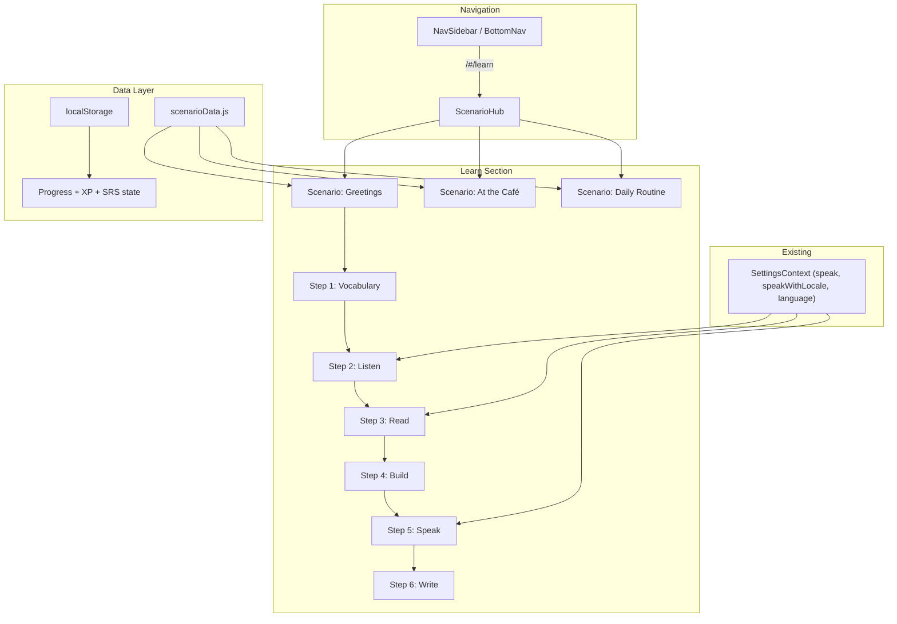

# Practical Language Learning Website — Scenario-Based

Build a new **"Learn"** section in the existing timerTool React app that teaches practical language skills through immersive, real-life scenarios. Each scenario bundles vocabulary, listening, reading, sentence building, speaking, and writing into a guided flow.

## Important Notes

> **Content authoring is the biggest effort.** Each scenario requires ~15 vocabulary items, a dialogue script, a reading passage, sentence-building exercises, and writing prompts — all translated into 3 languages. This plan hardcodes all content in JS data files (no backend), meaning the initial content for 3 scenarios across EN/DE/ES must be authored upfront.

> **Web Speech API limitations.** `SpeechSynthesis` quality varies across browsers/OS. German pronunciation is decent on macOS Safari/Chrome but can be robotic on some Android devices. `SpeechRecognition` (for speaking practice) is **not supported in Firefox** — only Chrome/Edge/Safari. The speaking step will show a graceful fallback message on unsupported browsers.

---

## Design Decisions Summary

| Decision | Choice |
|---|---|
| **Audience** | A0→A2, zero to basic conversation |
| **Languages** | Configurable; ship with EN / DE / ES |
| **Organization** | Scenario-based (real-life situations) |
| **Progression** | Guided flow within each scenario (Vocab → Listen → Read → Sentences → Speak → Write) |
| **Initial scenarios** | Greetings & Introductions, At the Café, Daily Routine |
| **SRS algorithm** | SM-2 (SuperMemo 2) |
| **Audio** | Web Speech API (SpeechSynthesis) via existing SettingsContext `speak()` / `speakWithLocale()` |
| **Persistence** | localStorage only, no backend |
| **Integration** | New "Learn" section in nav alongside existing pages |
| **Design** | Match existing Notion-inspired DESIGN.md (CSS custom properties) |
| **Gamification** | XP points + progress bars |
| **Layout priority** | Mobile-first |

---

## Architecture Overview

The app uses **hash-based routing** (`createHashRouter`) for gh-pages compatibility:

```
/#/learn                     → Scenario hub (list of all scenarios)
/#/learn/:scenarioId         → Scenario detail (guided step flow)
```

Each scenario has 6 ordered steps:
1. **Vocabulary** — Flashcards with images + SRS (SM-2)
2. **Listen** — Hear a dialogue via existing `speak()`/`speakWithLocale()`, answer comprehension questions
3. **Read** — Short passage with highlighted vocab, comprehension questions
4. **Build** — Tap-to-construct sentences from scrambled word banks
5. **Speak** — Pronunciation practice via existing `SpeechRecognition` pattern from SpeakerPage
6. **Write** — Fill-in-the-blank and free-form writing prompts



---

## Data Layer

### [NEW] `src/data/scenarioData.js`

Master data file containing all 3 scenarios. Each scenario object includes:

```js
{
  id: 'greetings',
  title: { en: 'Greetings & Introductions', de: 'Begrüßungen & Vorstellungen', es: 'Saludos y presentaciones' },
  description: { en: '...', de: '...', es: '...' },
  icon: '👋',
  level: 'A0',
  vocabulary: [
    {
      id: 'greet-1',
      word: { en: 'Hello', de: 'Hallo', es: 'Hola' },
      example: { en: 'Hello, my name is...', de: 'Hallo, mein Name ist...', es: 'Hola, mi nombre es...' },
      imageUrl: '...',  // Unsplash URL
    },
    // ~15 items per scenario
  ],
  dialogue: {
    participants: ['Anna', 'Ben'],
    lines: [
      { speaker: 'Anna', text: { en: 'Hello! My name is Anna.', de: 'Hallo! Mein Name ist Anna.', es: '¡Hola! Mi nombre es Anna.' } },
      // ...
    ],
    questions: [
      {
        question: { en: "What is the woman's name?", de: '...', es: '...' },
        options: { en: ['Anna', 'Maria', 'Lisa', 'Sara'], de: [...], es: [...] },
        correct: 0,
      },
    ],
  },
  reading: {
    passage: { en: '...', de: '...', es: '...' },
    highlightedWords: ['greet-1', 'greet-3'],  // refs to vocabulary IDs
    questions: [ ... ],
  },
  sentenceBuilding: [
    {
      target: { en: 'My name is Anna', de: 'Mein Name ist Anna', es: 'Mi nombre es Anna' },
      words: { en: ['name', 'My', 'Anna', 'is'], de: ['Name', 'Mein', 'Anna', 'ist'], es: ['nombre', 'Mi', 'Anna', 'es'] },
    },
  ],
  speaking: [
    {
      prompt: { en: 'Say: "Hello, my name is..."', de: '...', es: '...' },
      expected: { en: 'Hello my name is', de: 'Hallo mein Name ist', es: 'Hola mi nombre es' },
    },
  ],
  writing: [
    {
      type: 'fill-blank',
      template: { en: 'Hello, my ___ is Anna.', de: 'Hallo, mein ___ ist Anna.', es: 'Hola, mi ___ es Anna.' },
      answer: { en: 'name', de: 'Name', es: 'nombre' },
    },
    {
      type: 'free-form',
      prompt: { en: 'Write a short self-introduction.', de: '...', es: '...' },
    },
  ],
}
```

**Content per scenario:**

| Scenario | Vocab Items | Dialogue Lines | Exercises |
|---|---|---|---|
| Greetings & Introductions | ~15 | ~8 | 5 sentence builds, 4 speaking, 3 writing |
| At the Café / Restaurant | ~15 | ~10 | 5 sentence builds, 4 speaking, 3 writing |
| Daily Routine | ~15 | ~8 | 5 sentence builds, 4 speaking, 3 writing |

---

### [NEW] `src/utils/srs.js`

SM-2 spaced repetition algorithm implementation:
- `calculateNextReview(quality, repetitions, easeFactor, interval)` → returns `{ repetitions, easeFactor, interval, nextReviewDate }`
- `quality` parameter: 0–5 scale (0 = complete blackout, 5 = perfect recall)
- Stored per vocabulary item in localStorage

---

### [NEW] `src/utils/learnProgress.js`

Progress and XP management utilities:
- `getProgress(scenarioId)` → returns `{ completedSteps: [], xp, srsData: {} }`
- `saveStepCompletion(scenarioId, stepIndex, xpEarned)`
- `getTotalXP()` → sum across all scenarios
- `getSRSData(vocabId)` / `saveSRSData(vocabId, data)`
- All data persisted to localStorage under key `timerTool_learnProgress`

---

## Pages

### [NEW] `src/pages/LearnPage/LearnHub.jsx`

The main landing page for the Learn section at `/#/learn`. Displays:
- **Header** with total XP display and current language indicator (from `useSettings()`)
- **Scenario cards** — each scenario shown as a pastel-tinted card using existing CSS custom properties (`--card-tint-peach`, `--card-tint-mint`, `--card-tint-lavender`) with:
  - Scenario icon + title
  - Level badge (A0, A1, A2)
  - Progress bar (e.g., "3/6 steps complete")
  - Locked/unlocked state (first scenario always unlocked; others unlock when the previous is ≥50% complete)

---

### [NEW] `src/pages/LearnPage/ScenarioFlow.jsx`

The guided flow page at `/#/learn/:scenarioId`. Displays:
- **Step timeline** — horizontal step indicator showing all 6 steps with locked/unlocked/completed states
- **Current step content** — renders the appropriate step component based on internal step state
- **Navigation** — "Continue" button to advance to next step; back button to return to hub
- **XP award animation** — shows "+10 XP" pop-up when a step is completed

---

## Step Components

All step components live in `src/pages/LearnPage/steps/`:

### [NEW] `steps/VocabStep.jsx`

Flashcard-style vocabulary learning:
- Card shows image + word in target language
- Tap to reveal translation in native language (English)
- **Audio button** uses `useSettings().speak(word)` to pronounce the word
- Self-assessment buttons: "Again" (0), "Hard" (2), "Good" (4), "Easy" (5) — feeds SM-2
- Progress indicator (e.g., "5/15 words")
- Completion: all words reviewed at least once → step complete, +10 XP per word

---

### [NEW] `steps/ListenStep.jsx`

Dialogue listening comprehension:
- Play button triggers `speakWithLocale()` from SettingsContext to read each dialogue line sequentially
- Chat-bubble UI showing the dialogue (text hidden initially, revealed line-by-line as audio plays)
- After dialogue completes, show comprehension questions (multiple choice)
- Completion: answer all questions → +50 XP

---

### [NEW] `steps/ReadStep.jsx`

Reading comprehension:
- Full passage displayed with vocabulary words highlighted (clickable to see definition + hear pronunciation via `speak()`)
- TTS button to hear the full passage read aloud via `speak()`
- Comprehension questions below the passage
- Completion: answer all questions → +50 XP

---

### [NEW] `steps/BuildStep.jsx`

Sentence construction:
- Target sentence shown in English (native language)
- Scrambled word tiles in the target language
- User taps tiles in correct order to build the sentence
- Visual feedback: correct tiles snap into place (green), wrong selections shake (red) — uses existing `apple-active-scale` pattern
- Completion: all sentences built correctly → +30 XP per sentence

---

### [NEW] `steps/SpeakStep.jsx`

Pronunciation practice (modeled after SpeakerPage's speech recognition pattern):
- Prompt shown: "Say: [phrase in target language]"
- Play button to hear correct pronunciation via `speak()`
- Record button triggers `webkitSpeechRecognition` / `SpeechRecognition`
- Compare recognized text to expected text (fuzzy match with Levenshtein distance)
- Show accuracy percentage + visual feedback
- Graceful fallback for unsupported browsers (show message instead of record button)
- Completion: attempt all prompts → +30 XP per prompt

---

### [NEW] `steps/WriteStep.jsx`

Writing exercises:
- **Fill-in-the-blank**: sentence with blanks, user types the missing word(s)
- **Free-form**: open prompt (e.g., "Write a self-introduction"), text area, word count shown
- Validation: fill-blank checks exact match (case-insensitive); free-form requires minimum word count
- Completion: all exercises attempted → +40 XP

---

## Shared Components

All in `src/pages/LearnPage/components/`:

### [NEW] `components/ProgressBar.jsx`

Reusable animated progress bar with percentage label. Uses `--primary` (#5645d4) for fill color.

### [NEW] `components/XPDisplay.jsx`

XP counter with animated increment using CSS transitions. Shows total XP in the hub header and per-scenario XP on cards.

### [NEW] `components/StepTimeline.jsx`

Visual step indicator (6 steps). Shows icons for each step type, with states: locked (gray/`--stone`), current (purple pulse/`--primary`), completed (green check/`--semantic-success`).

### [NEW] `components/WordTile.jsx`

Tappable word tile for the sentence building exercise. Uses `--rounded-md` (8px) border radius per Notion design. Animated transitions for correct/incorrect states.

---

## Styling

### [NEW] `src/pages/LearnPage/LearnPage.css`

Comprehensive styles for all Learn section components, built on existing CSS custom properties from `index.css`:
- Scenario cards using `--card-tint-peach`, `--card-tint-mint`, `--card-tint-lavender`
- Step timeline with `--primary` active state
- Flashcard flip animations
- Word tile tap styling with `apple-active-scale` pattern
- Chat bubble styling for dialogues
- Mobile-first responsive layout (matches 768px breakpoint)
- XP pop-up animation (`@keyframes`)
- Consistent use of `--rounded-md` (8px) for buttons, `--rounded-lg` (12px) for cards
- Shadows from `--shadow-subtle`, `--shadow-card`

---

## Navigation Updates

### [MODIFY] `src/components/NavSidebar/NavSidebar.jsx`

Add a new nav link with inline SVG icon (matching the existing pattern — NO lucide-react):

```diff
+{/* Learn */}
+<NavLink
+  to="/learn"
+  className={({ isActive }) => `nav-item${isActive ? ' active' : ''}`}
+  aria-label="Learn Languages"
+  title="Learn"
+>
+  <LearnIcon />   {/* Inline SVG: graduation cap or book-open icon */}
+  <span className="nav-label">Learn</span>
+</NavLink>
```

Place after the divider, before Quiz.

---

### [MODIFY] `src/components/BottomNav/BottomNav.jsx`

Same addition — add Learn tab with inline SVG icon:

```diff
+<NavLink to="/learn" className={cls} aria-label="Learn Languages" title="Learn">
+  <LearnIcon />
+  <span>Learn</span>
+</NavLink>
```

---

### [MODIFY] `src/main.jsx`

Add routes to the `createHashRouter` children array:

```diff
+import LearnHub      from './pages/LearnPage/LearnHub.jsx'
+import ScenarioFlow  from './pages/LearnPage/ScenarioFlow.jsx'

 const router = createHashRouter([
   {
     path: "/",
     element: <App />,
     children: [
       { index: true, element: <TimerPage /> },
+      { path: "learn", element: <LearnHub /> },
+      { path: "learn/:scenarioId", element: <ScenarioFlow /> },
       { path: "quiz", element: <QuizPage /> },
       ...
     ],
   },
 ]);
```

---

## File Tree Summary

```
src/
├── data/
│   ├── vocabularyData.js          (existing, unchanged)
│   └── scenarioData.js            [NEW] — 3 scenarios with all content
├── utils/
│   ├── srs.js                     [NEW] — SM-2 algorithm
│   └── learnProgress.js           [NEW] — localStorage progress/XP mgmt
├── pages/
│   └── LearnPage/
│       ├── LearnHub.jsx           [NEW] — Scenario listing page
│       ├── ScenarioFlow.jsx       [NEW] — Guided step flow
│       ├── LearnPage.css          [NEW] — All learn section styles
│       ├── steps/
│       │   ├── VocabStep.jsx      [NEW]
│       │   ├── ListenStep.jsx     [NEW]
│       │   ├── ReadStep.jsx       [NEW]
│       │   ├── BuildStep.jsx      [NEW]
│       │   ├── SpeakStep.jsx      [NEW]
│       │   └── WriteStep.jsx      [NEW]
│       └── components/
│           ├── ProgressBar.jsx    [NEW]
│           ├── XPDisplay.jsx      [NEW]
│           ├── StepTimeline.jsx   [NEW]
│           └── WordTile.jsx       [NEW]
├── components/
│   ├── NavSidebar/NavSidebar.jsx  [MODIFY] — add Learn link (inline SVG)
│   └── BottomNav/BottomNav.jsx    [MODIFY] — add Learn tab (inline SVG)
└── main.jsx                       [MODIFY] — add Learn routes to createHashRouter
```

**Total: 14 new files, 3 modified files.**

---

## Verification Plan

### Automated Tests

```bash
npm run build
```
Verify the build completes without errors.

```bash
npm test
```
Run existing tests to confirm no regressions.

### Manual Verification

1. **Navigation**: Click "Learn" in sidebar and bottom nav → LearnHub loads
2. **Hash routing**: URL shows `/#/learn` (not `/learn`) — works with gh-pages
3. **Scenario cards**: All 3 scenarios visible with progress bars and pastel tint backgrounds
4. **Guided flow**: Click a scenario → step timeline shows, first step (Vocab) loads
5. **Vocabulary step**: Flashcards display with images, tap-to-reveal works, SM-2 buttons respond, `speak()` pronounces word
6. **Listen step**: Dialogue plays via `speakWithLocale()`, lines revealed sequentially, comprehension questions work
7. **Read step**: Passage displays with highlighted vocab, TTS works via `speak()`
8. **Build step**: Word tiles are tappable, correct order produces green feedback
9. **Speak step**: Microphone activates, speech recognition matches expected text
10. **Write step**: Fill-in-blank validates (case-insensitive), free-form shows word count
11. **XP system**: XP increments display correctly, persist across page reloads
12. **Progress persistence**: Refresh browser → progress retained in localStorage
13. **Language switching**: Change language in settings drawer → all Learn content switches to DE/EN/ES
14. **Mobile layout**: Test at ≤768px viewport — bottom nav shows Learn tab, layouts stack vertically
15. **Unsupported browser**: Open in Firefox → speaking step shows graceful fallback
